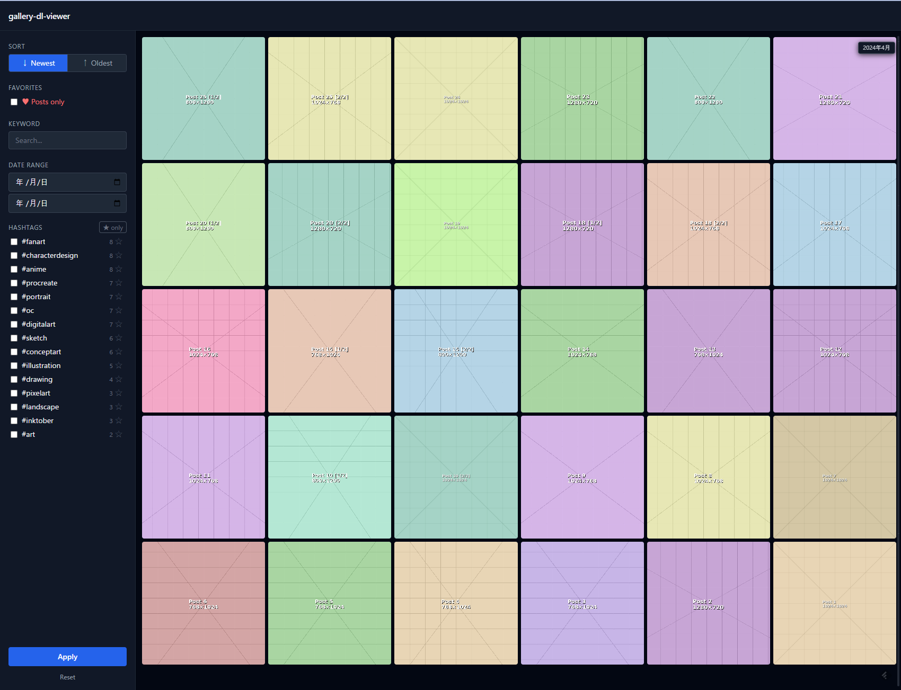
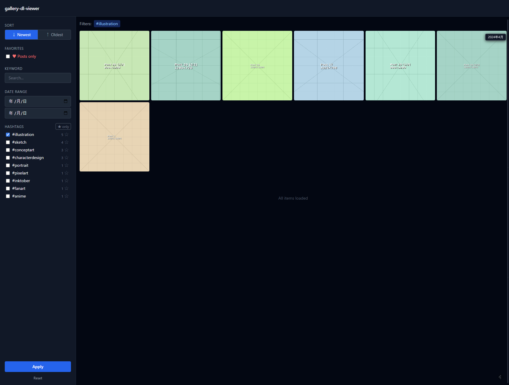
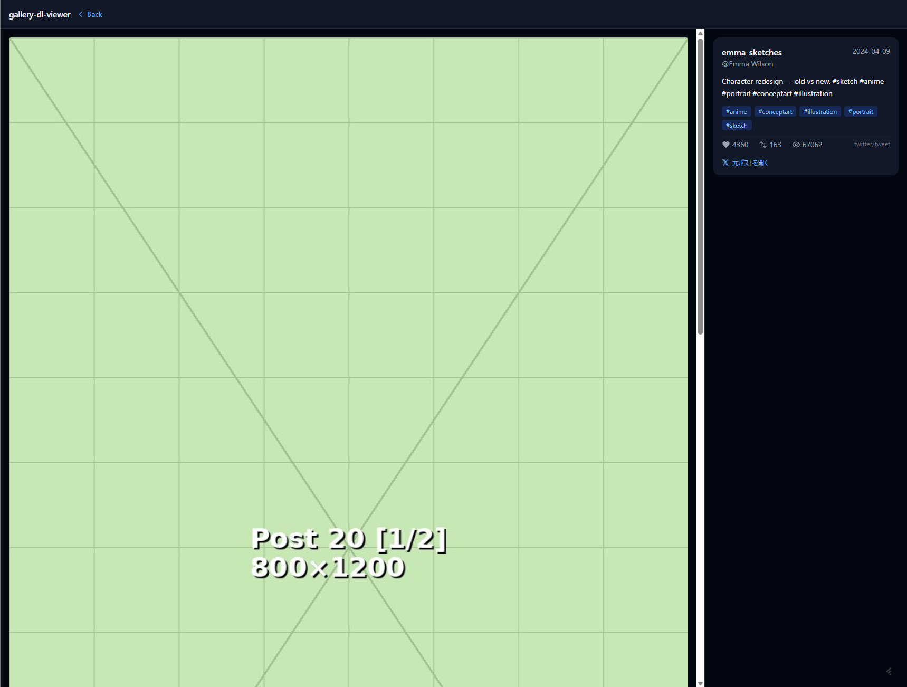
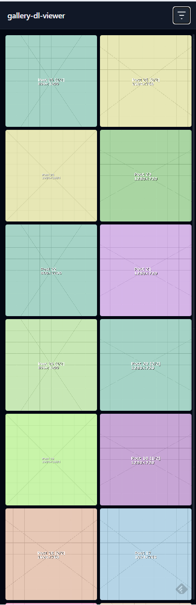
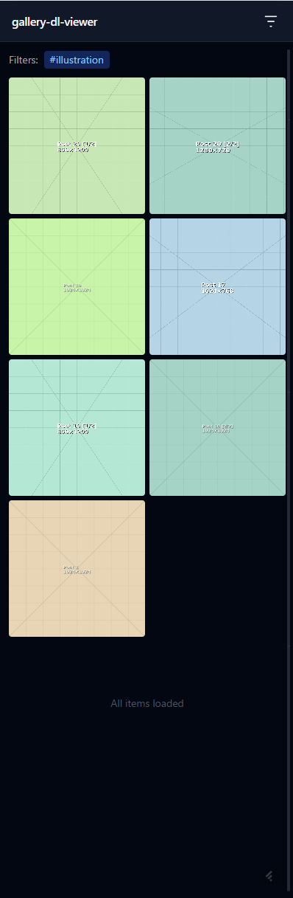
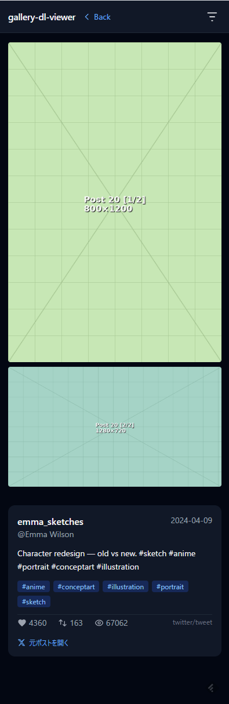
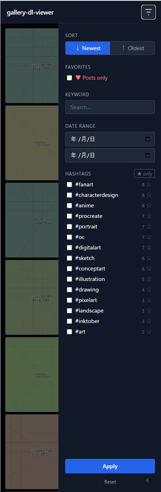

# gallery-dl-viewer

A lightweight web viewer for [gallery-dl](https://github.com/mikf/gallery-dl) archives.

Indexes gallery-dl's sidecar JSON metadata into SQLite and serves a fast, browsable gallery — without duplicating your original files.

**Supported platforms**: X/Twitter, Instagram, TikTok, Tumblr

## Scope

### What this tool does

- Browse and organize images and videos you have already downloaded with [gallery-dl](https://github.com/mikf/gallery-dl)
- Navigate your archive by hashtags, keyword search, date range, platform, and favorites
- Serve your original files directly — no duplication, no transcoding, minimal storage overhead

### What this tool does NOT do

- Download or scrape anything — use gallery-dl for that (including sidecar JSON generation)
- Modify, copy, or convert your original files

### Prerequisites

gallery-dl must be configured to write sidecar JSON alongside each downloaded file (see [gallery-dl Configuration](#gallery-dl-configuration) below). This viewer reads those JSON files to build its index.

### Out of scope

- gallery-dl usage and configuration
- NAS / network storage setup
- Scraping assistance
- Windows (WSL is likely to work but untested)

## Screenshots

### Desktop

| Gallery | Tag filter | Post detail |
|---|---|---|
|  |  |  |

### Mobile

| Gallery | Tag filter | Post detail | Filter sidebar |
|---|---|---|---|
|  |  |  |  |

## Features

- Browse images and videos downloaded by gallery-dl — X/Twitter, Instagram, TikTok, Tumblr
- Platform badge on every thumbnail; filter by platform in the sidebar
- Post detail page with author info, text, hashtags, and original post link per platform
- Filter by hashtags, keyword search, date range, and platform
- Sort newest or oldest first
- Favorites — per-image hearts and per-tag stars; filter to favorites only
- Infinite scroll
- Video autoplay on scroll into view (mobile) / hover (desktop)
- Mobile-responsive layout with swipe-to-open sidebar
- Re-upload detection (opt-in) — the same picture posted again by the same author is merged into one card, and newer copies can be moved out of your library (see [Duplicate images](#duplicate-images))

## Quick Start (Docker)

**1. Clone and configure**

```bash
git clone https://github.com/super-tuna/gallery-dl-viewer.git
cd gallery-dl-viewer
cp config.example.yaml config.yaml
```

`config.yaml` is ready to use with Docker defaults (`data_dirs: [/data]`, `db_path: /app/index.db`). No edits needed unless you change the port.

**2. Set environment variables**

```bash
cat << 'EOF' > .env
GALLERY_DATA_DIR=/path/to/your/gallery-dl/downloads
GALLERY_CONFIG_PATH=/path/to/gallery-dl-viewer/config.yaml
GALLERY_DB_PATH=/path/to/gallery-dl-viewer/index.db
# LOG_LEVEL=DEBUG  # uncomment for verbose logging
EOF
```

| Variable | Required | Default | Description |
|---|---|---|---|
| `GALLERY_DATA_DIR` | ✓ | — | Directory where gallery-dl saves files (mounted as `/data` inside the container) |
| `GALLERY_CONFIG_PATH` | ✓ | — | Absolute path to your `config.yaml` on the host |
| `GALLERY_DB_PATH` | ✓ | — | Absolute path where the SQLite index will be stored on the host |
| `LOG_LEVEL` | | `INFO` | Log verbosity: `DEBUG`, `INFO`, `WARNING`, `ERROR` |

`LOG_LEVEL=DEBUG` shows every indexed/skipped file, which is useful for diagnosing why files are not being picked up.

**3. Build the index**

```bash
docker compose run --rm indexer
```

Re-run this whenever new files are downloaded.

**4. Start the server**

```bash
docker compose up -d
```

Open http://localhost:8090 in your browser.

**Automating the index** (cron example):

```cron
0 4 * * * cd /path/to/gallery-dl-viewer && docker compose run --rm indexer >> logs/indexer.log 2>&1
```

## Installation (Python)

If you prefer running without Docker:

```bash
git clone https://github.com/super-tuna/gallery-dl-viewer.git
cd gallery-dl-viewer
python3 -m venv .venv
source .venv/bin/activate
pip install -r requirements.txt
```

**Configure**

```bash
cp config.example.yaml config.yaml
```

Edit `config.yaml` — the defaults are set for Docker, so update the paths for direct use:

```yaml
data_dirs:
  - /path/to/gallery-dl/output
db_path: ./index.db
host: 0.0.0.0
port: 8090
```

**Build the index**

```bash
python indexer.py
# or with verbose logging:
LOG_LEVEL=DEBUG python indexer.py
```

**Start the server**

```bash
python app.py
# or with verbose logging:
LOG_LEVEL=DEBUG python app.py
```

**Auto-start with systemd**

Create `/etc/systemd/system/gallery-dl-viewer.service`:

```ini
[Unit]
Description=gallery-dl-viewer
After=network.target

[Service]
Type=simple
User=YOUR_USER
WorkingDirectory=/path/to/gallery-dl-viewer
ExecStart=/path/to/gallery-dl-viewer/.venv/bin/uvicorn app:app --host 0.0.0.0 --port 8090
Restart=on-failure

[Install]
WantedBy=multi-user.target
```

```bash
sudo systemctl daemon-reload
sudo systemctl enable gallery-dl-viewer
sudo systemctl start gallery-dl-viewer
```

## Duplicate images

Authors often re-post an image they already posted. The platform re-encodes it, so the files differ byte-for-byte; gallery-dl-viewer compares the pictures themselves among images of the **same author with the same dimensions**: a perceptual hash finds candidates, then a pixel comparison rejects copies that differ locally (added text, doodles, stickers, retouching) while accepting re-encodes and brightness/contrast changes. When in doubt, images are kept apart.

**1. Enable** in `config.yaml` and re-run the indexer:

```yaml
dedupe: true
```

The first run fingerprints every image once (roughly 150–200 images/s over NFS); later runs only handle new files. Videos and GIFs are not compared.

**2. Browse** — each re-uploaded image now appears as a single card at its oldest post. On a post page, a duplicate is shown from the oldest copy with a “既出 → 元ポスト” link.

**3. Review** the detected groups at `http://localhost:8090/duplicates` (left: kept, right: newer copies).

**4. Move the newer copies away** (optional). This is the only step that writes to your download directory — the `dedupe` service mounts it read-write:

```bash
docker compose run --rm dedupe                                # dry-run: list what would move
docker compose run --rm dedupe python duplicates.py --apply   # move
```

Each copy is moved to `<data dir>/.trash/<same path>`; delete that folder once you are satisfied. The sidecar JSON stays in place together with a small `<file>.dup` marker naming the kept file, so posts keep showing all their images and a rebuilt index still knows the mapping. If you use gallery-dl's `archive` option, moved files are not downloaded again.

## gallery-dl Configuration

Sidecar JSON must be enabled in your gallery-dl `config.json`:

```json
{
  "extractor": {
    "postprocessors": [
      {"name": "metadata"}
    ]
  }
}
```

This creates a `.json` file alongside each downloaded media file containing post metadata (author, date, hashtags, etc.).

## Requirements

- Docker Compose v2 (recommended), **or** Python 3.10+
- gallery-dl archive with sidecar JSON enabled (see above)

## Support

- **OS**: Linux, macOS. Windows via WSL is likely to work but untested.
- **Issues**: Bug reports and feature requests for gallery-dl-viewer itself are welcome. Issues about gallery-dl usage, library dependencies, or your download setup are out of scope.

## Performance

Measured on a running instance (Docker, uvicorn single worker):

| Metric | Value |
|---|---|
| Posts indexed | ~14,000 (4 platforms) |
| Media files indexed | ~25,000 |
| SQLite DB size | ~12 MB |
| Process RSS | ~75 MB |

## Roadmap

### Phase 1 — Docker support + GitHub release ✓

- Docker Compose setup
- Portable DB (relative file paths)
- README and public release prep

### Phase 2 — Multi-platform support ✓

Added support for Instagram, Tumblr, and TikTok alongside X/Twitter.

- Platform-aware post ID extraction (`tweet_id`, `shortcode`, `id`) per `category` field in sidecar JSON
- Platform-specific author, content, and stats parsing
- Platform badge (icon) on every gallery thumbnail
- Platform filter in the sidebar
- Per-platform original post links on the detail page

### Phase 3 — LoRA workflow features

**Auto-tagging**

Automatic image tagging pipeline integrated into the indexer (`--tag` flag):

| Step | Model | Use |
|---|---|---|
| Anime/photo classifier | SigLIP (`google/siglip-base-patch16-256`) | Route images to the right tagger |
| Anime attribute tags | WD14 ONNX | Character traits, composition |
| Pose/face detection (photo) | MediaPipe | Composition and pose tags |

**GUI-triggered indexing**

`POST /api/index` endpoint to kick off the indexer from the browser (Photoprism-style).

**Bulk export for LoRA training**

Export favorites or filtered results to a target directory with captions (`.txt` sidecar files) in a layout compatible with kohya\_ss and similar training tools.

## License

MIT
